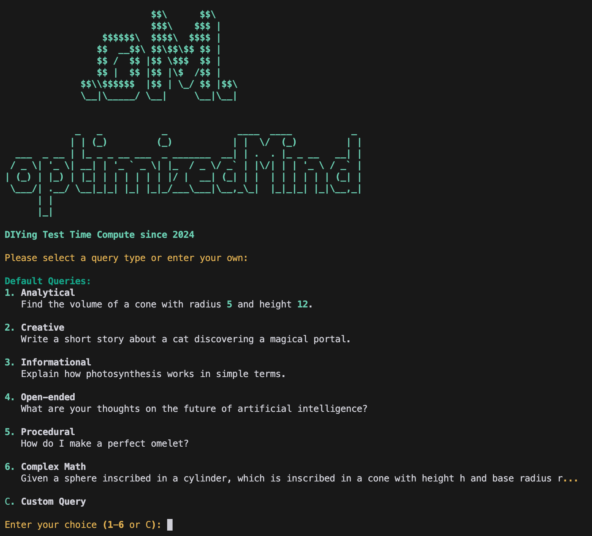
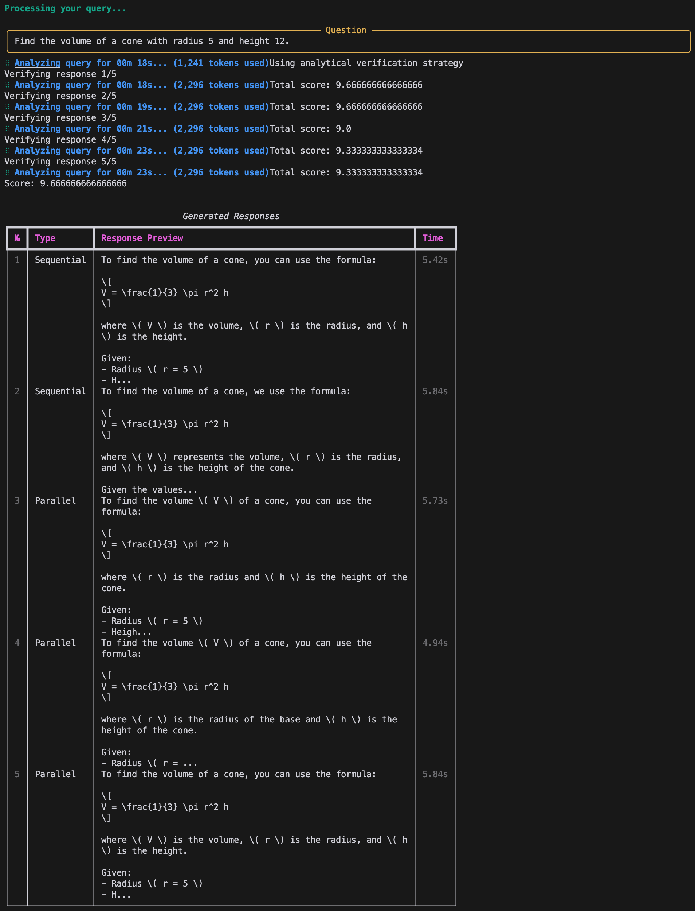
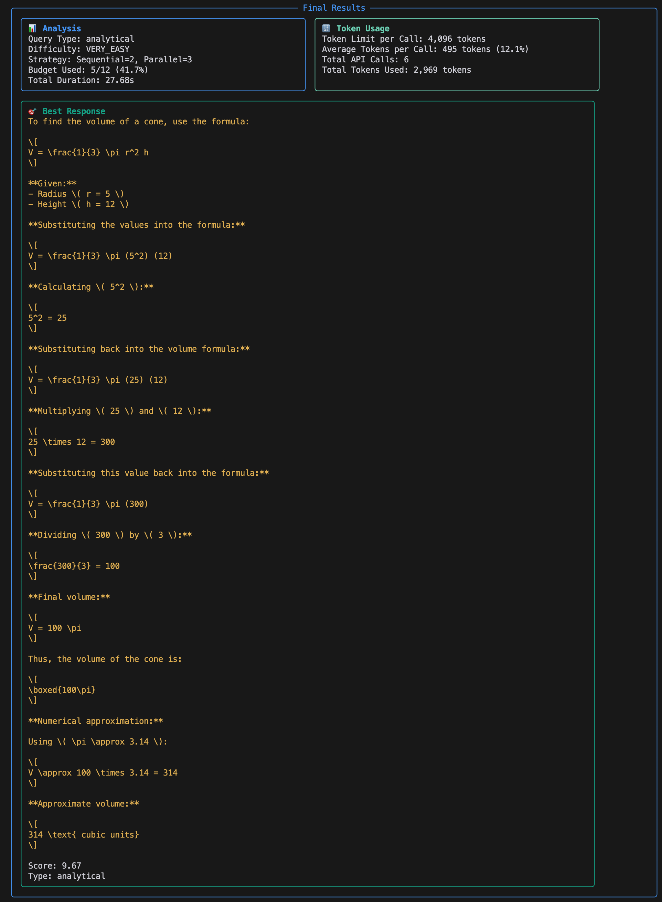

# optimizedMind (oM) DIY Test Time Compute



A DIY approach to optimizing LLM response generation through parallel and sequential processing strategies. Join us in demonstrating that enhanced LLM reasoning can be achieved through open-source community efforts!

## Overview

Test Time Compute (TTC) is an experimental framework that enhances the quality of LLM responses by:
- Running multiple parallel and sequential generations
- Evaluating responses based on type-specific criteria
- Dynamically adjusting generation parameters based on query complexity
- Providing detailed analytics on token usage and performance

The goal of this project is to show that we can collectively improve LLM reasoning through DIY methods, making advanced AI techniques more accessible to the community.

This project was inspired by groundbreaking research demonstrating that optimizing test-time compute can be more effective than scaling model parameters ([Snell et al., 2024](https://arxiv.org/abs/2408.03314)). Their work shows that with optimal test-time compute strategies, smaller models can potentially outperform much larger ones, making advanced AI capabilities more accessible to the broader community.

## Features

- **Query Classification**: Automatically categorizes queries into analytical, creative, informational, open-ended, or procedural types
- **Dynamic Difficulty Assessment**: Estimates query complexity to optimize processing strategy
- **Adaptive Processing**: Combines parallel and sequential generations based on query type and difficulty
- **Smart Evaluation**: Type-specific evaluation criteria for different kinds of queries
- **Comprehensive Verification**: New pipeline for mathematical and logical analysis of responses
- **Cross-validation**: Comparison and validation between multiple responses
- **Dynamic Budget Management**: Adjusts computation budget based on response quality
- **Enhanced Analytics**: Detailed token usage tracking and performance metrics
- **Rich Console Interface**: Beautiful command-line interface with real-time status updates and progress tracking

## Processing Example



The system generates multiple responses using both sequential and parallel strategies, then evaluates them based on type-specific criteria.

## Results Display



Results are presented with detailed analytics including:
- Query analysis and difficulty assessment
- Token usage statistics
- Best response with evaluation score

## Installation

1. Clone the repository:
```bash
git clone https://github.com/kaneda2004/optimizedmind-ttc.git
cd optimizedmind-ttc
```

2. Install dependencies:
```bash
pip install -r requirements.txt
```

3. Set up your OpenAI API key:
```bash
export OPENAI_API_KEY='your-api-key-here'
```

## Usage

Run the program:
```bash
python ttc_oai.py
```

You can then:
1. Choose from predefined query types (analytical, creative, informational, etc.)
2. Enter your own custom query
3. Watch as the system processes and evaluates multiple responses
4. Review the final results with detailed analytics

## Requirements

- Python 3.7+
- OpenAI API key
- Dependencies listed in requirements.txt

## How It Works

1. **Query Analysis**:
   - Classifies query type
   - Estimates difficulty
   - Determines optimal processing strategy

2. **Response Generation**:
   - Generates responses in parallel and sequence
   - Adapts generation parameters based on query type
   - Uses previous responses to improve subsequent generations
   - Implements dynamic budget allocation based on response quality

3. **Verification & Evaluation**:
   - Applies comprehensive verification pipeline
   - Performs mathematical and logical analysis
   - Cross-validates multiple responses
   - Ranks responses based on quality metrics
   - Selects and formats the best response

4. **Analytics**:
   - Tracks token usage and costs
   - Measures processing time
   - Provides detailed performance metrics
   - Generates verification reports
   - Logs system behavior for analysis

## Join the DIY AI Movement!

This project is part of a larger movement to democratize advanced AI techniques. We believe that through community effort and open-source collaboration, we can develop innovative approaches to enhance LLM capabilities.

### Ways to Contribute:
- **Experiment & Share**: Try different strategies and share your results
- **Add Features**: Implement new processing methods or evaluation criteria
- **Improve Analytics**: Help develop better ways to measure and optimize performance
- **Documentation**: Help make these techniques more accessible to others
- **Bug Reports**: Help us identify and fix issues
- **Feature Requests**: Share your ideas for new capabilities

Together, we can push the boundaries of what's possible with DIY AI enhancement!

## License

MIT License - feel free to use this in your own projects!

## Acknowledgments

This project builds upon the research presented in ["Scaling LLM Test-Time Compute Optimally can be More Effective than Scaling Model Parameters"](https://arxiv.org/abs/2408.03314) by Charlie Snell, Jaehoon Lee, Kelvin Xu, and Aviral Kumar. Their groundbreaking work demonstrated that optimizing test-time compute can be more effective than increasing model size, inspiring this DIY implementation.

Built with:
- OpenAI's GPT API
- Rich for beautiful console output
- Python's asyncio for concurrent processing

Special thanks to:
- The research team for their innovative work on test-time compute optimization
- The open-source community for inspiring this DIY approach to AI enhancement 